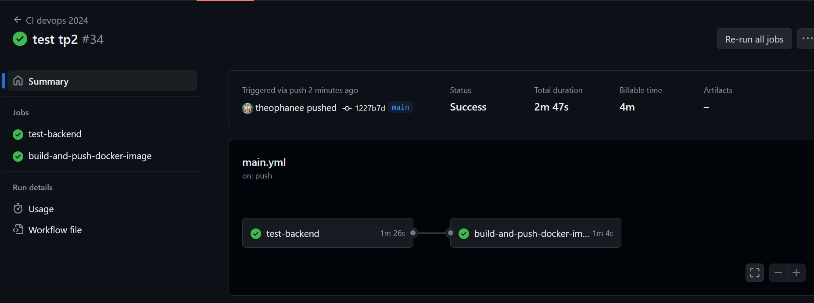
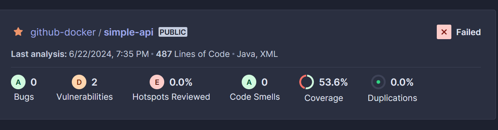

<h1>Database</h1>
<h3>Basics</h3>

(Les résultats de ces questions sont dans ``/database``)  

</br>

``docker build -t my-postgres-image .`` pour build l'image avec pour nom *my-postgres-image*.  
``docker run -d --name my-postgres-container --network app-network -p 5432:5432 -e POSTGRES_DB=db -e POSTGRES_USER=usr -e POSTGRES_PASSWORD=pwd my-postgres-image`` pour démarrer le conteneur de l'image avec l'option -e pour rentrer les valeurs de POSTGRES.  

Je vérifie que le conteneur est en cours d'exécution avec ``docker ps`` :  
``CONTAINER ID   IMAGE               COMMAND                  CREATED              STATUS              PORTS                    NAMES ``  
``48f014228c50   my-postgres-image   "docker-entrypoint.s…"   About a minute ago   Up About a minute   0.0.0.0:5432->5432/tcp   my-postgres-container ``.  

Je retrouve donc bien mon container *my-postgres-container*.  

J'ai ensuite run l'admirer avec ``docker run -d --name adminer-container --network app-network -p 8080:8080 adminer``.  
Puis sur ma page localhost, la page SQL s'affiche, et je renseigne les données :
- Système : PostgreSQL
- Serveur : my-postgres-container
- Utilisateur : usr
- Mot de passe : pwd
- Base de données : db  

Et j'ai donc pu accéder à ma base de donnée.  

<h3>Init database</h3>

On cherche à initialiser notre BDD avec l'image docker, on va utiliser des scripts pour ça.   
J'ai mis les 2 scripts SQL dans le répertoire `/sql-inits/` et j'ai rajouté dans le Dockerfile cette ligne ``COPY sql-scripts/*.sql /docker-entrypoint-initdb.d/`` qui permet de préciser les fichiers à utiliser pour initialiser notre BDD dans l'image.  

Je peux ensuite faire ``ls /docker-entrypoint-initdb.d/`` pour vérifier que les scripts sont bien chargés.  

Quand je charge ma page localhost j'ai bien mes 2 tables de créer. Je teste aussi avec `psql` :
```
db=# \dt
          List of relations
 Schema |    Name     | Type  | Owner
--------+-------------+-------+-------
 public | departments | table | usr
 public | students    | table | usr
(2 rows)

db=# SELECT * FROM students;
 id | department_id | first_name | last_name 
----+---------------+------------+-----------
  1 |             1 | Eli        | Copter
  2 |             2 | Emma       | Carena
  3 |             2 | Jack       | Uzzi
  4 |             3 | Aude       | Javel
(4 rows)

db=# SELECT * FROM departments;
 id | name
----+------
  1 | IRC
  2 | ETI
  3 | CGP
(3 rows)

```

<h3>Persist data</h3>

Je crée d'abord mon volume `docker volume create postgres-data`.  
Je supprime l'ancien adminer :
- ``docker stop my-postgres-container adminer-container`` 
- ``docker rm my-postgres-container adminer-container``

Puis je démarre un nouveau container et son adminer : 
- ``docker run -d --name my-postgres-container --network app-network -p 5432:5432 -v postgres-data:/var/lib/postgresql/data -e POSTGRES_DB=db -e POSTGRES_USER=usr -e POSTGRES_PASSWORD=pwd my-postgres-image``
- ``docker run -d --name adminer-container --network app-network -p 8090:8080 adminer``
J'utilise bien `-v postgres-data:/var/lib/postgresql/data`.

Sur ma page localhost, j'ai bien mes tables toujours présentes. Quand je recréer mon container j'ai toujours mes données.

<h1>Backend API</h1>
<h3>Basics</h3>

J'ai copier-coller le Main.java et je l'ai compilé, j'ai donc mon `Main.class`.  

J'ai donc rajouté dans le Dockerfile 
```java
FROM eclipse-temurin:21-jre-alpine

# Add the compiled java (aka bytecode, aka .class)
COPY Main.class /app/
WORKDIR /app

# Run the Java with: “java Main” command.
CMD ["java", "Main"]
```

Puis je build `docker build -t java-hello-world .` et j'exécute avec `docker run --rm java-hello-world`.   
J'ai bien sur ma console : ``docker run --rm java-hello-world Hello World!``.  Donc notre ``Main.java`` se lance bien avec notre image.  

<h3>Multistage build</h3>
<h4>Backend simple api</h4>

(Les résultats de ces questions sont dans ``/simpleapi``)

J'ai installer Spring Boot avec java21 car je n'avais pas le 17.  
J'ai donc dû modifier le Dockerfile avec : `FROM maven:3.9.7-eclipse-temurin-21-alpine AS myapp-build` et `FROM openjdk:21-jdk-slim AS myapp-runtime`, trouvé sur Docker Hub.  

La construction en plusieurs étapes sert à optimiser la taille de l'image finale et augmente la sécurité car elle limite l'affichage de dépendances et fichiers inutiles dans l'image finale. Ainsi, seuls les choses utiles pour l'image finale sont visibles et réduit donc le champ d'attaques potentielles.  

```Dockerfile
# Build
# Définit l'image de base
FROM maven:3.9.7-eclipse-temurin-21-alpine AS myapp-build
# Variable d'environnement qui pointe vers le réprtoire de l'app
ENV MYAPP_HOME /opt/myapp
# Définit le répertoire de l'app pour exécuter les commandes
WORKDIR $MYAPP_HOME
# Copie les répertoires du build local vers le répertoire de l'image
COPY pom.xml .
COPY src ./src
# Exécute la cmd Maven avec l'option pour ignorer les tests unitaires
RUN mvn package -DskipTests

# Run
# Définit l'image pour l'exécution
FROM openjdk:21-jdk-slim AS myapp-runtime
ENV MYAPP_HOME /opt/myapp
WORKDIR $MYAPP_HOME
# Copie le JAR du build précédent vers le répertoire d'exécution
COPY --from=myapp-build $MYAPP_HOME/target/*.jar $MYAPP_HOME/myapp.jar

# Exécute l'application avec myapp.jar
ENTRYPOINT java -jar myapp.jar
```

J'ai ensuite placer le Dockerfile au même niveau que le pom.xml pour lancer le build `docker build -t my-springboot-app .` et j'ai lancé avec `docker run -p 8080:8080 my-springboot-app`.  

<h4>Backend API</h4>

(Résultats de ces questions dans ``/simple-api-student``)

Pour correspondre à nos valeurs données à la database, j'ai donc ajusté les valeurs de application.yml comme ceci :
```yml
spring:
  jpa:
    properties:
      hibernate:
        jdbc:
          lob:
            non_contextual_creation: true
    generate-ddl: false
    open-in-view: true
  datasource:
    url: jdbc:postgresql://my-postgres-container:5432/db
    username: usr
    password: pwd
    driver-class-name: org.postgresql.Driver
management:
 server:
   add-application-context-header: false
 endpoints:
   web:
     exposure:
       include: health,info,env,metrics,beans,configprops

```  

``docker build . -t simple-api``  
après création du network postgresql :
``docker run --name my-springboot-container --network my-network -p 8080:8080 simple-api`` et j'ai bien dans ma console :  
````0	  
id	1  
firstname	"Eli"  
lastname	"Copter"
department	
id	1
name	"IRC"
````


<h1>Http server</h1>

<h3>Choose an appropriate base image.</h3>
<h3>Configuration</h3>

Je télécharge le *httpd.conf* de Docker Desktop et je le place dans mon dossier httpd.

```
# Utiliser l'image de base Apache
FROM httpd:2.4

# Copier le fichier de configuration httpd.conf corrigé dans l'image
COPY httpd.conf /usr/local/apache2/conf/httpd.conf

# Copier la page index.html dans le répertoire de contenu web
COPY index.html /usr/local/apache2/htdocs/
```

Je build mon docker avec `docker build -t my-http-server .` puis je run `docker run -d -p 8080:80 --name my-http-container my-http-server`. 

<h3>Reverse proxy</h3>

Je copie-colle ce code :
````<VirtualHost *:80>
ProxyPreserveHost On
ProxyPass / http://backend:8080/
ProxyPassReverse / http://backend:8080/
</VirtualHost>
LoadModule proxy_module modules/mod_proxy.so
LoadModule proxy_http_module modules/mod_proxy_http.so
````
à la fin de *httpd.conf*. Le proxy améliore la répartition de la charge, la sécurité, le chache et la performance de l'application.  

<h3>Link application</h3>

Je renseigne toutes les informations comme databse, backend et httpd de la même façon que je le faisait dans les réponses précédentes tout en attachant le réseau.

````yml
services:
  database:
    build:
      context: ./database
    environment:
      POSTGRES_DB: db
      POSTGRES_USER: usr
      POSTGRES_PASSWORD: pwd
    networks:
      - my-network

  backend:
    build:
      context: ./simple-api-student
    networks:
      - my-network
    depends_on:
      - database
    environment:
      SPRING_DATASOURCE_URL: jdbc:postgresql://database:5432/db
      SPRING_DATASOURCE_USERNAME: usr
      SPRING_DATASOURCE_PASSWORD: pwd

  httpd:
    build:
      context: ./httpd
    ports:
      - "8080:80"
    networks:
      - my-network
    depends_on:
      - backend

networks:
  my-network:
````

Puis je lance mon `docker compose up --build` qui va donc lancer tout mes DockerFile et je peux enfin voir mon application sur *http://localhost:8080/*.  
Docker Compose simplifie la gestion du multi-container car il configure, démarre et arrête tous les services de l'application avec un seul fichier et une seule commande.  

<h3>Publish</h3>

J'enchaîne les commandes suivantes : 
> \> docker login  
Authenticating with existing credentials...  
Login Succeeded  
> \> docker tag my-database tcaraux/my-database:1.0   
> \> docker push tcaraux/my-database:1.0  
> \> docker tag my-httpd tcaraux/httpd:2.4   
> \> docker push tcaraux/httpd:2.4  
> \> docker tag my-backend tcaraux/backend:lastest
> \> docker push tcaraux/backend:lastest  

Pour ``docker tag my-httpd tcaraux/httpd:2.4`` je crée une étiquette pour l'image ``my-httpd`` et je la nomme ``tcaraux/my-httpd`` avec la version 2.4. Cela sert à identifier et versionner mon image pour ensuite la pousser vers Docker Hub.  
Ainsi, avec ``docker push tcaraux/httpd:2.4  `` je pousse l'image my-httpd sur Docker Hub pour que d'autres développeurs puissent l'utiliser.  

Ainsi, j'obtiens sur Docker Hub :  
  

<h1>Discover Github Action</h1>
<h3>Setup GitHub Actions</h3>

<h3>Build and test your Application</h3>

Les conteneurs de test permettent d'exécuter et de valider des logiciels, ce qui facilite la détection d'erreur.  

J'ai rajouté les dépendances dans le pom.xl :

````xml
<dependencies>
    <dependency>
        <groupId>org.testcontainers</groupId>
        <artifactId>testcontainers</artifactId>
        <version>${testcontainers.version}</version>
        <scope>test</scope>
    </dependency>
    <dependency>
        <groupId>org.testcontainers</groupId>
        <artifactId>jdbc</artifactId>
        <version>${testcontainers.version}</version>
        <scope>test</scope>
    </dependency>
    <dependency>
        <groupId>org.testcontainers</groupId>
        <artifactId>postgresql</artifactId>
        <version>${testcontainers.version}</version>
        <scope>test</scope>
    </dependency>
</dependencies>
````

Je me place dans ``/simpleapi`` et je lance `mvn clean verify`.  
````
[INFO] -------------------------------------------------------
[INFO]  T E S T S
[INFO] -------------------------------------------------------
Results:
Tests run: 1, Failures: 0, Errors: 0, Skipped: 0
BUILD SUCCESS
````

J'ai donc mis dans main.yml : 
```yml
name: CI devops 2024
on:
  #to begin you want to launch this job in main and develop
  push:
    branches: 
      - main 
      - develop
  pull_request:

jobs:
  test-backend: 
    runs-on: ubuntu-22.04
    steps:
     #checkout your github code using actions/checkout@v2.5.0
      - uses: actions/checkout@v2.5.0

     #do the same with another action (actions/setup-java@v3) that enable to setup jdk 17
      - name: Set up JDK 21
        uses: actions/setup-java@v3
        with:
          distribution: 'temurin' 
          java-version: 21

     #finally build your app with the latest command
      - name: Build and test with Maven
        run: mvn clean verify --file simpleapi/pom.xml
```
Les branhes permettent de préciser sur quelles branches le workflow doit se lancé.  
J'ai mis JDK21 parce que je n'ai pas java17 sur mon pc. Je précise la configuration Java avec `use`, je paramètre l'action avec `with` (distribution JDK, Version de Java).   
Et le mvn clean verify à la fin pour nettoyer le projet et des.  

<h3>First steps into the CD World</h3>

Dans Github, j'ai rajouter des *Secrets* pour renseigner mes DockerHub username et token. Puis, j'ai fais un deuxième job qui permet de se connecter à Docker Hub avec l'username et le token dans mes secrets.  

```yml
  build-and-push-docker-image:
    needs: test-backend
    runs-on: ubuntu-22.04

    steps:
      - name: Checkout code
        uses: actions/checkout@v2.5.0

      - name: Login to DockerHub 
        uses: docker/login-action@v2
        with:
          username: ${{ secrets.DOCKERHUB_USERNAME }}
          password: ${{ secrets.DOCKERHUB_TOKEN }}
```

Pour push, j'ai donc fais comme l'exemple pour les 3 images (backend, databse, httpd) :  
```yml
      - name: Build image and push backend
        uses: docker/build-push-action@v3
        with:
          context: ./simple-api-student
          tags: ${{ secrets.DOCKERHUB_USERNAME }}/tp-devops-simple-api:latest
          push: ${{ github.ref == 'refs/heads/main' }}

      - name: Build image and push database
        uses: docker/build-push-action@v3
        with:
          context: ./database
          tags: ${{ secrets.DOCKERHUB_USERNAME }}/tp-devops-database:latest
          push: ${{ github.ref == 'refs/heads/main' }}

      - name: Build image and push httpd
        uses: docker/build-push-action@v3
        with:
          context: ./httpd
          tags: ${{ secrets.DOCKERHUB_USERNAME }}/tp-devops-httpd:latest
          push: ${{ github.ref == 'refs/heads/main' }}
```
A la fin, j'ai bien mes images sur mon Docker Hub :
 

Et mes tests sont corrects :
 

<h1>Setup Quality Gate</h1>

<h3>Register to SonarCloud</h3>

Je me suis enregistré sur SonardCloud, j'ai récupérer les valeurs de SONAR_TOKEN que j'ai mis en *Secrets* sur Github.  
Et je lance donc ensuite dans main.yml :
`mvn -B verify sonar:sonar -Dsonar.projectKey=github-docker_tcaraux -Dsonar.organization=github-docker -Dsonar.host.url=https://sonarcloud.io -Dsonar.login=${{ secrets.SONAR_TOKEN }}  --file ./simple-api-student/pom.xml`  


 

J'ai une erreur lors de l'analyse mais c'est normal car nous n'avons pas respecté les bonnes normes de codages. 

<h1>Ansible</h1>

<h1>Introduction</h1>
<h3>Inventories</h3>

Pas mal de problèmes de droits sur Windows avec *id_rsa*, on a trouvé une solution :
````
icacls .\inventories\id_rsa /inheritance:r   
icacls .\inventories\id_rsa /remove:g "utilisateurs"  
icacls .\inventories\id_rsa /grant:r %username%:R   
ssh -i .\inventories\id_rsa centos@theophane.caraux.takima.cloud  
````

Ensuite, il faut déplacer *id_rsa* dans son environnement ubuntu et lui donner les droits appropriés :  
````
mkdir -p ~/.ssh   
chmod 700 ~/.ssh  
mv ./id_rsa ~/.ssh/  
ls -l ~/.ssh/id_rsa  
chmod 600 ~/.ssh/id_rsa 
````

Puis, sur mon ubuntu :  
```
$ ansible all -m ping --private-key=/home/tcaraux/.ssh/id_rsa -u centos  
theophane.caraux.takima.cloud | SUCCESS => {
    "ansible_facts": {
        "discovered_interpreter_python": "/usr/bin/python"
    },
    "changed": false,
    "ping": "pong"
}
```
<h3>Facts</h3>

Ici, on collecte les informations sur l'hôte qui tourne sous CentOS version 7.9 Core, une distribution RedHat et utilise Python :
```
ansible all -i inventories/setup.yml -m setup -a "filter=ansible_distribution*"
theophane.caraux.takima.cloud | SUCCESS => {
    "ansible_facts": {
        "ansible_distribution": "CentOS",
        "ansible_distribution_file_parsed": true,
        "ansible_distribution_file_path": "/etc/redhat-release",
        "ansible_distribution_file_variety": "RedHat",
        "ansible_distribution_major_version": "7",
        "ansible_distribution_release": "Core",
        "ansible_distribution_version": "7.9",
        "discovered_interpreter_python": "/usr/bin/python"
    },
    "changed": false
}
```

Ici, *Ansible* cherche a supprimer ``httpd`` avec state=absent. On voit bien que ``httpd is not installed``.
```
ansible all -i inventories/setup.yml -m yum -a "name=httpd state=absent" --become
theophane.caraux.takima.cloud | SUCCESS => {
    "ansible_facts": {
        "discovered_interpreter_python": "/usr/bin/python"
    },
    "changed": false,
    "msg": "",
    "rc": 0,
    "results": [
        "httpd is not installed"
    ]
}
```

<h1>Playbooks</h1>

<h3>First playbook</h3>

```
ansible-playbook -i inventories/setup.yml playbook.yml

PLAY [all] *************************************************************************************************

TASK [Test connection] *************************************************************************************
ok: [theophane.caraux.takima.cloud]

PLAY RECAP *************************************************************************************************
theophane.caraux.takima.cloud : ok=1    changed=0    unreachable=0    failed=0    skipped=0    rescued=0    ignored=0
```

<h3>Advanced Playbook</h3>

Avant de reprendre le TP, comme le serveur a été reconstruit il faut supprimer l'entrée obsolète *known_hosts*. Avec cette commande : `ssh-keygen -f "/home/tcaraux/.ssh/known_hosts" -R "theophane.caraux.takima.cloud"`.  

Pendant le TP de lundi, la tâche `Install device-mapper-persistent-data` me renvoyait une erreur incompréhensible. On me disait que l'url ne m'acceptait pas ou ne m'était pas accordé. Désormais, je n'ai rien changé mais `ansible-playbook -i inventories/setup.yml playbook.yml` fonctionne bien :  
```
PLAY [all] *****************************************************************************************************************

TASK [Install device-mapper-persistent-data] *******************************************************************************
changed: [theophane.caraux.takima.cloud]

TASK [Install lvm2] ********************************************************************************************************
changed: [theophane.caraux.takima.cloud]

TASK [add repo docker] *****************************************************************************************************
[WARNING]: Consider using 'become', 'become_method', and 'become_user' rather than running sudo
changed: [theophane.caraux.takima.cloud]

TASK [Install Docker] ******************************************************************************************************
changed: [theophane.caraux.takima.cloud]

TASK [Install python3] *****************************************************************************************************
changed: [theophane.caraux.takima.cloud]

TASK [Install docker with Python 3] ****************************************************************************************
changed: [theophane.caraux.takima.cloud]

TASK [Make sure Docker is running] *****************************************************************************************
changed: [theophane.caraux.takima.cloud]

PLAY RECAP *****************************************************************************************************************
theophane.caraux.takima.cloud : ok=7    changed=7    unreachable=0    failed=0    skipped=0    rescued=0    ignored=0       
```

<h3>Using roles</h3>

On veut donc organiser le playbook avec des rôles pour rendre la configuration plus propre et modulaire.  

```
ansible-galaxy init roles/docker  
- Role roles/docker was created successfully  
```

On a donc maintenant un dossier roles/docker/. Dedans se trouve plusieurs dossiers mais le plus intéressant est celui de tasks/main.yml. On va donc mettre notre *Install Docker* dans tasks/main.yml pour être mieux organiser en rajoutant des *notify* pour pouvoir notifier le `handler` et simplement appeler le rôle `docker` dans ansible/playbook.yml que je viens de créer. Le handler permet de gérer les notifications comme `restart docker` un service après une mise à jour.    

```
ansible-playbook -i inventories/setup.yml playbook.yml

PLAY [all] *****************************************************************************************************************

TASK [docker : Install device-mapper-persistent-data] **********************************************************************
ok: [theophane.caraux.takima.cloud]

TASK [docker : Install lvm2] ***********************************************************************************************
ok: [theophane.caraux.takima.cloud]

TASK [docker : add repo docker] ********************************************************************************************
changed: [theophane.caraux.takima.cloud]

TASK [docker : Install Docker] *********************************************************************************************
ok: [theophane.caraux.takima.cloud]

TASK [docker : Install python3] ********************************************************************************************
ok: [theophane.caraux.takima.cloud]

TASK [docker : Install docker with Python 3] *******************************************************************************
ok: [theophane.caraux.takima.cloud]

TASK [docker : Make sure Docker is running] ********************************************************************************
ok: [theophane.caraux.takima.cloud]

RUNNING HANDLER [docker : restart docker] **********************************************************************************
changed: [theophane.caraux.takima.cloud]

PLAY RECAP *****************************************************************************************************************
theophane.caraux.takima.cloud : ok=8    changed=2    unreachable=0    failed=0    skipped=0    rescued=0    ignored=0            
```
<h1>Deploy your App</h1>

Je vais donc créer des rôles pour :
- install docker
- create network
- launch database
- launch app
- launch proxy

Par exemple pour ``create_network`` :
```yml
- name: Create Docker network
  docker_network:
    name: my_network
    driver: bridge
  vars:
    ansible_python_interpreter: /usr/bin/python3
```

Je précise ma version de python à ``ansible_python_interpreter``.  

Pour ``launch_database``, j'ai créer mon ``.env`` avec mes données pour accéder à la BDD et j'ai mis ce ``.env`` dans mon environnement avec la commande ``scp ../database/.env centos@theophane.caraux.takima.cloud:/home/centos/``. J'ai donc :  
```yml
- name: Run Database
  docker_container:
    name: my_database
    image: postgres:latest
    env_file: /home/centos/.env 
    networks:
      - name: my_network
    state: started
  vars:
    ansible_python_interpreter: /usr/bin/python3
```
Je lui donne son image et son env.  

De même que pour la db, pour mon app j'ai :
```yml
- name: Run Application
  docker_container:
    name: simple-api-student
    image: tcaraux/simple-api-student:latest
    env_file: /home/centos/application.yml
    networks:
      - name: my_network
    state: started
  vars:
    ansible_python_interpreter: /usr/bin/python3
```

Je lui donne son image et j'ai aussi placer dans mon environnement application.yml avec `scp ../simple-api-student/src/main/resources/application.yml centos@theophane.caraux.takima.cloud:/home/centos/`.

Quand je lance ma commande j'ai toujours cette erreur 
```
TASK [launch_app : Run Application] ************************************************************************************************************************************************************************
An exception occurred during task execution. To see the full traceback, use -vvv. The error was: spring:
fatal: [theophane.caraux.takima.cloud]: FAILED! => {"changed": false, "msg": "An unexpected docker error occurred: Invalid line in environment file /home/centos/application.yml:\nspring:"}
```

L'option `-vvv` ne me donne pas plus d'information, j'ai essayé d'enlever le `---` au début du fichier ou de transformer mes valeurs en String avec des ``''`` (``username: usr`` devient ``username: 'usr'``).  

Tous les autres rôles sont `ok`, il n'y a que celui-ci en `failed`.
Dommage, je n'ai pas trouvé de solutions à ce problème, c'était la dernière étape.  

Résultat avec `-vvv` :
```
The full traceback is:
Traceback (most recent call last):
  File "/tmp/ansible_docker_container_payload_a1gnb_fl/ansible_docker_container_payload.zip/ansible/modules/cloud/docker/docker_container.py", line 3360, in main
  File "/tmp/ansible_docker_container_payload_a1gnb_fl/ansible_docker_container_payload.zip/ansible/modules/cloud/docker/docker_container.py", line 2559, in __init__
  File "/tmp/ansible_docker_container_payload_a1gnb_fl/ansible_docker_container_payload.zip/ansible/modules/cloud/docker/docker_container.py", line 1297, in __init__
  File "/tmp/ansible_docker_container_payload_a1gnb_fl/ansible_docker_container_payload.zip/ansible/modules/cloud/docker/docker_container.py", line 1788, in _get_environment
  File "/usr/local/lib/python3.6/site-packages/docker/utils/utils.py", line 458, in parse_env_file
    env_file, line))
docker.errors.DockerException: Invalid line in environment file /home/centos/application.yml:
spring:
fatal: [theophane.caraux.takima.cloud]: FAILED! => {
    "changed": false,
    "invocation": {
        "module_args": {
            "api_version": "auto",
            "auto_remove": false,
            "blkio_weight": null,
            "ca_cert": null,
            "cap_drop": null,
            "capabilities": null,
            "cleanup": false,
            "client_cert": null,
            "client_key": null,
            "command": null,
            "comparisons": null,
            "cpu_period": null,
            "cpu_quota": null,
            "cpu_shares": null,
            "cpuset_cpus": null,
            "cpuset_mems": null,
            "debug": false,
            "detach": true,
            "device_read_bps": null,
            "device_read_iops": null,
            "device_write_bps": null,
            "device_write_iops": null,
            "devices": null,
            "dns_opts": null,
            "dns_search_domains": null,
            "dns_servers": null,
            "docker_host": "unix://var/run/docker.sock",
            "domainname": null,
            "entrypoint": null,
            "env": null,
            "env_file": "/home/centos/application.yml",
            "etc_hosts": null,
            "exposed_ports": null,
            "force_kill": false,
            "groups": null,
            "healthcheck": null,
            "hostname": null,
            "ignore_image": false,
            "image": "tcaraux/simple-api-student:latest",
            "init": false,
            "interactive": false,
            "ipc_mode": null,
            "keep_volumes": true,
            "kernel_memory": null,
            "kill_signal": null,
            "labels": null,
            "links": null,
            "log_driver": null,
            "log_options": null,
            "mac_address": null,
            "memory": "0",
            "memory_reservation": null,
            "memory_swap": null,
            "memory_swappiness": null,
            "mounts": null,
            "name": "simple-api-student",
            "network_mode": null,
            "networks": [
                {
                    "aliases": null,
                    "ipv4_address": null,
                    "ipv6_address": null,
                    "links": null,
                    "name": "my_network"
                }
            ],
            "networks_cli_compatible": null,
            "oom_killer": null,
            "oom_score_adj": null,
            "output_logs": false,
            "paused": false,
            "pid_mode": null,
            "pids_limit": null,
            "privileged": false,
            "published_ports": null,
            "pull": false,
            "purge_networks": false,
            "read_only": false,
            "recreate": false,
            "restart": false,
            "restart_policy": null,
            "restart_retries": null,
            "runtime": null,
            "security_opts": null,
            "shm_size": null,
            "ssl_version": null,
            "state": "started",
            "stop_signal": null,
            "stop_timeout": null,
            "sysctls": null,
            "timeout": 60,
            "tls": false,
            "tls_hostname": "localhost",
            "tmpfs": null,
            "trust_image_content": false,
            "tty": false,
            "ulimits": null,
            "user": null,
            "userns_mode": null,
            "uts": null,
            "validate_certs": false,
            "volume_driver": null,
            "volumes": null,
            "volumes_from": null,
            "working_dir": null
        }
    },
    "msg": "An unexpected docker error occurred: Invalid line in environment file /home/centos/application.yml:\nspring:"
}
```